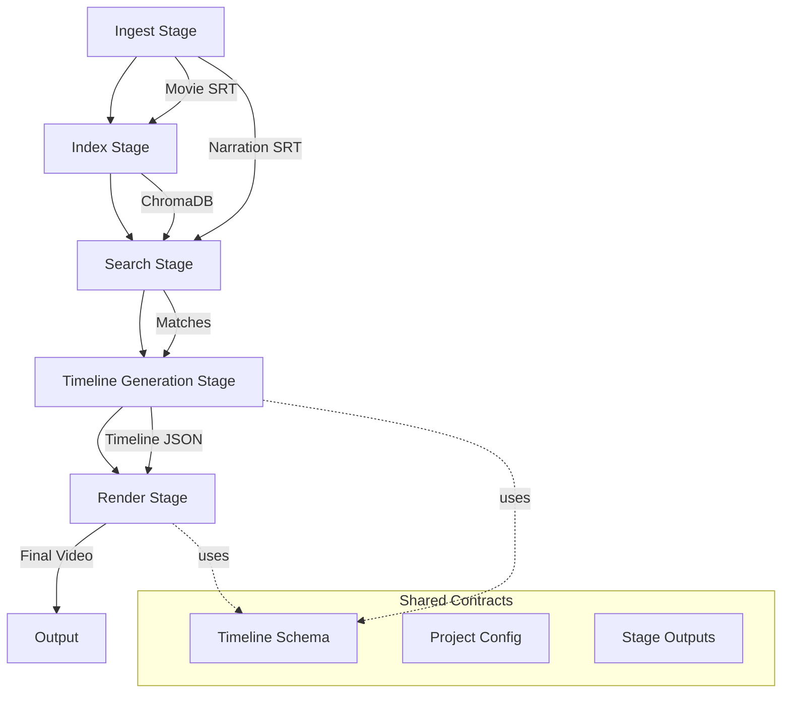

# Productio

n Architecture for AI-Assisted Movie Critique Video Generation

## High-Level Architecture

The system follows a **stage-based pipeline architecture** where each stage is independently runnable and communicates via well-defined JSON contracts. The architecture separates:

- **Domain Logic**: Core business rules (chunking, matching, filtering)
- **Infrastructure**: External services (ChromaDB, FFmpeg, embedding models)
- **Orchestration**: Stage coordination and workflow management
- **Contracts**: Shared schemas and data formats

### System Flow




## Proposed Folder Structure

```javascript
filmer/
├── legacy/                          # Original standalone tools
│   ├── cut_video.py                # Original FFmpeg cutter (unchanged)
│   └── README.md                   # Usage instructions
│
├── src/                            # Main source code
│   ├── core/                       # Domain logic (business rules)
│   │   ├── __init__.py
│   │   ├── chunking.py             # SRT chunking logic
│   │   ├── matching.py             # Semantic matching algorithms
│   │   ├── filtering.py            # Overlap removal, spoiler avoidance
│   │   └── timeline_builder.py     # Timeline JSON generation
│   │
│   ├── stages/                     # Pipeline stages (orchestration)
│   │   ├── __init__.py
│   │   ├── base.py                 # BaseStage interface (run, load, save)
│   │   ├── ingest.py               # Stage 1: File ingestion & validation
│   │   ├── index.py                # Stage 2: Movie subtitle indexing
│   │   ├── search.py               # Stage 3: Narration search
│   │   ├── timeline.py               # Stage 4: Timeline generation
│   │   └── render.py               # Stage 5: Video rendering
│   │
│   ├── adapters/                   # External service adapters
│   │   ├── __init__.py
│   │   ├── chromadb_adapter.py     # ChromaDB operations
│   │   ├── ffmpeg_adapter.py       # FFmpeg operations
│   │   └── embedding_adapter.py    # Embedding model interface
│   │
│   ├── contracts/                  # Shared schemas & data models
│   │   ├── __init__.py
│   │   ├── schemas/                # JSON Schema definitions
│   │   │   ├── timeline.schema.json
│   │   │   ├── project.schema.json
│   │   │   └── stage_outputs.schema.json
│   │   └── models/                 # Pydantic models (runtime validation)
│   │       ├── timeline.py         # Timeline Pydantic model
│   │       ├── project.py          # Project config Pydantic model
│   │       └── stage_outputs.py    # Inter-stage data models
│   │
│   └── utils/                      # Shared utilities
│       ├── __init__.py
│       ├── srt_parser.py           # SRT file parsing
│       ├── file_utils.py           # File operations
│       └── logging_config.py       # Logging setup
│
├── api/                            # Future Web API layer
│   ├── __init__.py
│   ├── main.py                     # FastAPI app entry point
│   ├── routes/                      # API endpoints
│   │   ├── projects.py             # Project management
│   │   ├── stages.py               # Stage execution
│   │   └── files.py                # File upload/download
│   └── models/                     # API request/response models
│       ├── project_requests.py
│       └── stage_requests.py
│
├── projects/                       # Project workspaces
│   └── {project_id}/               # e.g., tt0133093, critique_001
│       ├── data/                   # Project-specific input data
│       │   ├── movie.mp4           # Optional: reference video
│       │   ├── movie.srt
│       │   ├── narration.wav      # Narration audio file
│       │   └── narration.srt
│       ├── index/                  # ChromaDB data (if local)
│       │   └── chroma/
│       ├── configs/                # Project configuration
│       │   └── project.json
│       ├── outputs/                # Generated files
│       │   ├── timeline.json
│       │   └── final.mp4
│       └── logs/                   # Stage execution logs
│
├── shared/                         # Shared resources
│   ├── films/                      # Legacy structure (migrated)
│   │   ├── input/
│   │   ├── narration/
│   │   └── output/
│   └── models/                     # Embedding model cache/config
│
├── config/                         # System configuration
│   ├── default.yaml                # Default settings
│   ├── embedding.yaml              # Embedding model config
│   └── ffmpeg.yaml                 # FFmpeg settings
│
├── tests/                          # Test suite
│   ├── unit/
│   ├── integration/
│   └── fixtures/
│
├── scripts/                        # Utility scripts
│   ├── run_stage.py                # CLI for running individual stages
│   ├── run_pipeline.py             # Run full pipeline
│   └── migrate_legacy.py           # Migrate old projects
│
├── requirements.txt
├── pyproject.toml
└── README.md
```


## Folder Explanations

### `legacy/`

Preserves the original `cut_video.py` as a standalone tool. Users can still use it directly with `timeline.json` files. No modifications needed.

### `src/core/`

Pure domain logic with no external dependencies. Contains business rules:

- **chunking.py**: Time/word-based chunking algorithms
- **matching.py**: Similarity threshold, overlap detection
- **filtering.py**: Spoiler avoidance, scene weighting, priority rules
- **timeline_builder.py**: Constructs timeline JSON from matched segments

### `src/stages/`

Pipeline stages that orchestrate core logic and adapters. All stages implement `BaseStage` interface:

- **base.py**: Defines `BaseStage` abstract class with methods:
- `run(project_id, config)`: Execute stage logic
- `load_input(project_id)`: Load previous stage output or project files
- `save_output(project_id, data)`: Save stage output
- `validate(config)`: Validate stage configuration

Each concrete stage:

- Implements `BaseStage` interface
- Reads input from previous stage or project files
- Executes domain logic via `core/`
- Uses adapters for external services
- Writes output to project workspace or next stage
- Can be run independently via CLI or API

### `src/adapters/`

Abstraction layer for external services:

- **chromadb_adapter.py**: Collection management, queries, inserts
- **ffmpeg_adapter.py**: Video cutting, encoding, overlay operations
- **embedding_adapter.py**: Model loading, text embedding, caching

### `src/contracts/`

Shared data schemas and validation with separation of concerns:

- **schemas/**: JSON Schema files for validation and documentation
- `timeline.schema.json`: Timeline JSON schema (v1.0 frozen)
- `project.schema.json`: Project configuration schema
- `stage_outputs.schema.json`: Inter-stage data formats
- **models/**: Pydantic models for runtime validation and FastAPI integration
- `timeline.py`: Timeline Pydantic model (matches JSON schema)
- `project.py`: Project config Pydantic model
- `stage_outputs.py`: Inter-stage data Pydantic models

**Benefits**: JSON Schema for docs/validation, Pydantic for runtime type safety and FastAPI integration.

### `projects/{project_id}/`

Self-contained project workspaces following standardized structure:

- **data/**: Input files (movie SRT, narration SRT/audio, optional video)
- **index/**: ChromaDB index data (if using local storage)
- **configs/**: Project configuration JSON
- **outputs/**: Generated timeline.json and final video
- **logs/**: Stage execution logs

Each project:

- Has unique identifier (IMDb ID or custom)
- Is completely isolated from other projects
- Can be archived/moved as a single unit
- Fully browsable in UI
- Supports batch operations

### `api/`

Future FastAPI web layer for:

- File uploads
- Project creation/management
- Stage execution via HTTP
- Progress tracking
- Preset management

## Canonical Timeline JSON Schema

The timeline schema extends the current format to support future features while maintaining backward compatibility:

```json
{
  "$schema": "http://json-schema.org/draft-07/schema#",
  "type": "object",
  "required": ["input", "narration", "output", "segments"],
  "properties": {
    "input": {
      "type": "string",
      "description": "Path to input video file"
    },
    "narration": {
      "type": "string",
      "description": "Path to narration audio file"
    },
    "output": {
      "type": "string",
      "description": "Path to output video file"
    },
    "segments": {
      "type": "array",
      "items": {
        "type": "object",
        "required": ["start", "end"],
        "properties": {
          "start": {
            "type": "number",
            "description": "Segment start time in seconds"
          },
          "end": {
            "type": "number",
            "description": "Segment end time in seconds"
          },
          "score": {
            "type": "number",
            "minimum": 0,
            "maximum": 1,
            "description": "Similarity score (optional)"
          },
          "priority": {
            "type": "integer",
            "minimum": 1,
            "maximum": 10,
            "description": "Clip priority for selection (optional)"
          },
          "weight": {
            "type": "number",
            "description": "Scene weight for filtering (optional)"
          },
          "spoiler": {
            "type": "object",
            "description": "Spoiler risk assessment (optional)",
            "properties": {
              "risk": {
                "type": "number",
                "minimum": 0,
                "maximum": 1,
                "description": "Spoiler risk score (0=safe, 1=severe spoiler)"
              },
              "reason": {
                "type": "string",
                "enum": ["plot_twist", "ending", "character_death", "none"],
                "description": "Reason for spoiler risk"
              },
              "confidence": {
                "type": "number",
                "minimum": 0,
                "maximum": 1,
                "description": "Confidence in spoiler detection"
              }
            }
          },
          "transitions": {
            "type": "object",
            "properties": {
              "before": {
                "type": "string",
                "enum": ["cut", "fade", "dissolve", "wipe"]
              },
              "after": {
                "type": "string",
                "enum": ["cut", "fade", "dissolve", "wipe"]
              },
              "duration": {
                "type": "number",
                "description": "Transition duration in seconds"
              }
            }
          },
          "overlays": {
            "type": "array",
            "items": {
              "type": "object",
              "properties": {
                "type": {
                  "type": "string",
                  "enum": ["logo", "text", "watermark"]
                },
                "start": {"type": "number"},
                "end": {"type": "number"},
                "position": {"type": "string"},
                "file": {"type": "string"}
              }
            }
          },
          "cta_insert": {
            "type": "object",
            "properties": {
              "enabled": {"type": "boolean"},
              "text": {"type": "string"},
              "link": {"type": "string"}
            }
          },
          "narration_alignment": {
            "type": "object",
            "properties": {
              "offset": {
                "type": "number",
                "description": "Audio offset in seconds"
              },
              "stretch": {
                "type": "number",
                "description": "Time stretch factor"
              }
            }
          }
        }
      }
    },
    "global_overlays": {
      "type": "array",
      "description": "Global overlays applied to entire video (optional)",
      "items": {
        "type": "object",
        "properties": {
          "type": {
            "type": "string",
            "enum": ["logo", "text", "watermark"]
          },
          "position": {
            "type": "string",
            "enum": ["top-left", "top-right", "bottom-left", "bottom-right", "center"]
          },
          "file": {"type": "string"},
          "opacity": {
            "type": "number",
            "minimum": 0,
            "maximum": 1
          },
          "start_time": {"type": "number"},
          "end_time": {"type": "number"}
        }
      }
    },
    "metadata": {
      "type": "object",
      "properties": {
        "project_id": {"type": "string"},
        "movie_id": {"type": "string"},
        "generated_at": {"type": "string", "format": "date-time"},
        "version": {"type": "string"},
        "options": {
          "type": "object",
          "properties": {
            "spoiler_safe_mode": {"type": "boolean"},
            "spoiler_risk_threshold": {
              "type": "number",
              "minimum": 0,
              "maximum": 1,
              "description": "Maximum allowed spoiler risk (0-1)"
            },
            "max_duration": {"type": "number"},
            "min_segment_length": {"type": "number"},
            "similarity_threshold": {"type": "number"}
          }
        }
      }
    }
  }
}
```

**Backward Compatibility**: The current `timeline.json` format (input, narration, output, segments with start/end) remains fully valid. New fields are optional.

## Technology Recommendations

### Primary Language: **Python**

- Rich ecosystem for ML/AI (embedding models, ChromaDB)
- Excellent FFmpeg bindings
- FastAPI for modern async web APIs
- Easy integration with existing codebase
- Strong data science tooling

### Web Layer: **FastAPI**

- Async support for long-running operations
- Automatic OpenAPI documentation
- Type validation via Pydantic
- WebSocket support for progress updates
- Easy file upload handling

### Alternative Consideration: **Go**

- Better performance for heavy I/O
- Strong concurrency model
- Single binary deployment
- However: weaker ML ecosystem, requires more FFmpeg integration work

**Recommendation**: Stick with Python for MVP, consider Go for specific high-performance stages later.

## User Workflow Design

### Project Creation

1. User provides **IMDb ID** or custom project identifier
2. System creates `projects/{project_id}/` workspace
3. User uploads/drops files:

- Movie SRT → `projects/{project_id}/data/movie.srt`
- Narration SRT → `projects/{project_id}/data/narration.srt`
- (Optional) Reference video → `projects/{project_id}/data/movie.mp4`

### Configuration & Options

User sets options in `projects/{project_id}/config.json`:

```json
{
  "movie_id": "tt0133093",
  "options": {
    "spoiler_safe_mode": true,
    "max_duration": 1200,
    "similarity_threshold": 0.75,
    "min_segment_length": 3.0,
    "preset": "standard"
  },
  "embedding": {
    "model": "sentence-transformers/all-MiniLM-L6-v2"
  }
}
```


### Pipeline Execution

- **CLI**: `python scripts/run_pipeline.py --project-id tt0133093`
- **Individual stages**: `python scripts/run_stage.py index --project-id tt0133093`
- **Future Web UI**: POST `/api/projects/{project_id}/run` with stage selection

### Presets

Common configurations stored in `config/presets.yaml`:

- `quick`: Fast processing, lower quality
- `standard`: Balanced quality/speed
- `spoiler_safe`: Filters spoiler segments
- `high_quality`: Best quality, slower

## Future Extension Points

### 1. **Spoiler Avoidance** (`src/core/filtering.py`)

- Load spoiler time ranges from external source
- Filter segments that overlap with spoiler windows
- Weight segments based on distance from spoilers

### 2. **Scene Weighting** (`src/core/filtering.py`)

- Analyze scene types (action, dialogue, etc.)
- Apply weights based on user preferences
- Prioritize high-weight segments in timeline

### 3. **CTA Insertion** (`src/stages/render.py` + FFmpeg)

- Insert call-to-action overlays at specified points
- Support text, images, or video CTAs
- Configurable timing and positioning

### 4. **Logo Overlays** (`src/adapters/ffmpeg_adapter.py`)

- Add logo watermarking via FFmpeg filters
- Support multiple logo positions
- Configurable opacity and timing

### 5. **Transitions** (`src/stages/render.py`)

- Implement fade, dissolve, wipe transitions
- Auto-insert between segments
- Custom transition timing

### 6. **Narration Alignment** (`src/core/timeline_builder.py`)

- Detect narration pacing
- Adjust segment timing to match narration
- Support time-stretching for synchronization

### 7. **Batch Processing** (`scripts/batch_processor.py`)

- Process multiple projects in parallel
- Queue management
- Progress tracking

### 8. **Web UI** (`api/` + frontend)

- React/Vue frontend
- Real-time progress via WebSockets
- File drag-and-drop
- Preset selection UI
- Preview timeline before rendering

## Implementation Phases

### Phase 1: Foundation

- Create folder structure
- Move existing code to `legacy/`
- Implement `BaseStage` interface in `src/stages/base.py`
- Create JSON Schema files in `contracts/schemas/`
- Implement Pydantic models in `contracts/models/`
- Freeze timeline schema v1.0

### Phase 2: Core Pipeline

- Implement `ingest`, `index`, `search`, `timeline_generate` stages
- Build ChromaDB adapter
- Create SRT parser utilities
- Test with sample data

### Phase 3: Render Integration

- Implement `render` stage using FFmpeg adapter
- Ensure backward compatibility with existing timeline.json
- Test end-to-end pipeline

### Phase 4: Extensions

- Add filtering rules (spoiler, weighting)
- Implement overlap resolution
- Add transition support

### Phase 5: API Layer

- Build FastAPI application
- Implement project management endpoints
- Add file upload handling
- Create progress tracking

### Phase 6: UI

- Build frontend application
- Integrate with API
- Add real-time updates

## Key Design Principles

1. **Separation of Concerns**: Domain logic isolated from infrastructure
2. **Contract-First**: All stages communicate via well-defined schemas
3. **Independence**: Each stage runnable standalone for testing/debugging
4. **Extensibility**: New features added via plugins/filters, not core changes
5. **Backward Compatibility**: Existing timeline.json format always supported
6. **Interface-Based Design**: All stages implement BaseStage for unified CLI/API usage
7. **Schema/Model Separation**: JSON Schema for validation/docs, Pydantic for runtime

## Recommended Next Steps

### Immediate Priority: Stage Interface + Timeline Contract Freeze

**Goal**: Prove the architecture with a minimal end-to-end implementation.

#### Step 1: Implement BaseStage Interface

- Create `src/stages/base.py` with abstract `BaseStage` class
- Define methods: `run()`, `load_input()`, `save_output()`, `validate()`
- All future stages will inherit from this interface

#### Step 2: Freeze Timeline Schema v1.0

- Create `src/contracts/schemas/timeline.schema.json` (frozen version)
- Create `src/contracts/models/timeline.py` (Pydantic model)
- Ensure backward compatibility with existing `timeline.json` format
- Document all optional fields and extensions

#### Step 3: Implement Timeline Generation Stage

- Create `src/stages/timeline.py` inheriting from `BaseStage`
- Use mock/simple matching logic initially
- Output: `projects/{project_id}/outputs/timeline.json`
- Verify output works with legacy `cut_video.py`

#### Step 4: End-to-End Proof

- Run timeline stage → generate timeline.json
- Feed to legacy cutter → produce video
- Validate the contract works correctly

**Why This Approach**:

- Proves the architecture works
- Establishes the contract as the integration point
- Makes UI and automation trivial to add later
- Minimal code, maximum validation

### Future Stages (After Proof)

1. Ingest stage (file validation)
2. Index stage (ChromaDB population)
3. Search stage (semantic matching)
4. Render stage (new FFmpeg adapter)

## Spoiler Risk System

The spoiler system uses a risk-based approach instead of simple boolean:

### Risk Levels

- **0.0-0.3**: Safe (no spoilers)
- **0.3-0.6**: Risky (minor spoilers)
- **0.6-1.0**: Forbidden (major spoilers)

### Configuration

```json
{
  "options": {
    "spoiler_safe_mode": true,
    "spoiler_risk_threshold": 0.3
  }
}
```

Segments with `spoiler.risk > spoiler_risk_threshold` are filtered out when `spoiler_safe_mode` is enabled.

### Benefits

- Gradual filtering (not binary)
- Configurable sensitivity